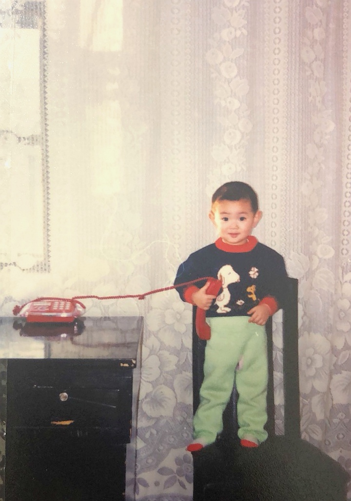

<!DOCTYPE html>
<html lang="en">
<head>
  <meta charset="UTF-8">
  <meta name="viewport" content="width=device-width, initial-scale=1.0">
  <title>Xiande Ma | Northeastern University</title>
  
</head>
<body>

  <header>
    
马先德 (Xiande Ma)

    <nav>
      <a href="/">Home</a>
      <a href="/publications">Publications</a>
      <a href="/cv">CV</a>
    </nav>
  </header>

  
  

    (Listening for that Nature Communications call... 📞)
  

  

    Hullo! 👋 I am a Ph.D. Candidate in the <b>Materials Science and Engineering (MSE)</b> Department at <b>Northeastern University (NEU)</b>. My research focuses on the atomic-scale origin of pyramidal dislocation slip in magnesium alloys, combining advanced <b>HAADF-STEM</b> characterization with <b>DFT</b> and <b>MD</b> simulations.
  

  <h3>Recent News 📰</h3>
  <ul>
    <li>2026/04: Our research on "Atomic-scale origin of pyramidal dislocation slip" is under review at <i>Nature Communications</i>. 🚀</li>
    <li>2024/12: Awarded the <b>National Scholarship for Doctoral Students</b>. 🏆</li>
  </ul>

  

  <h3>Research Interests 🔬</h3>
  <ul>
    <li>• <b>Lightweight Alloys</b>: Magnesium-Rare Earth (Mg-RE) systems.</li>
    <li>• <b>Microstructure</b>: Interfacial complexion and strengthening mechanisms.</li>
    <li>• <b>Simulation</b>: Atomic-resolution characterization and DFT/MD modeling.</li>
  </ul>

  <h3>Contact ✉️</h3>
  

    <b>Email:</b> maxiande@hotmail.com 
    <b>Lab:</b> Professor Ren Yuping's Group, NEU 
    <b>Location:</b> Shenyang, China
  

</body>
</html>
